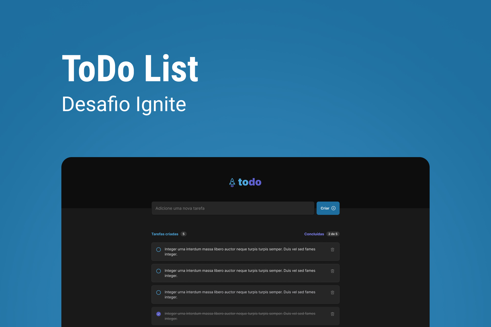

<h1 align="center"> Ignite ToDo List </h1>

Primeiro desafio de React da trilha 2022 do bootcamp Ignite da Rocketseat.

  <a href="#-projeto">Projeto</a>&nbsp;&nbsp;&nbsp;|&nbsp;&nbsp;&nbsp;
  <a href="#-tecnologias">Tecnologias</a>&nbsp;&nbsp;&nbsp;|&nbsp;&nbsp;&nbsp;
  <a href="#-como-executar">Como executar</a>&nbsp;&nbsp;&nbsp;|&nbsp;&nbsp;&nbsp;
  <a href="#-layout">Layout</a>

 

  

## 💻 Projeto

Uma ToDo list criada para praticar os conceitos básicos do ReactJS.

## ✨ Tecnologias

Esse projeto foi desenvolvido com as seguintes tecnologias:

- ReactJS
- TypeScript
- Phosphor Icons
- RadixUI

## 🚀 Como executar

Para executar a aplicação é necessário usar os seguintes comandos no terminal:
- `pnpm install` para instalar as dependências da aplicação.
- `pnpm dev` para executar a aplicação.

## 🔖 Layout

Você pode visualizar o layout do projeto através [DESSE LINK](https://www.figma.com/file/7TDsmLYc3cxvkTSixx4I8Z/ToDo-List---Ignite?node-id=0%3A1&t=gZoAjrmAHfIlMgWJ-1).
